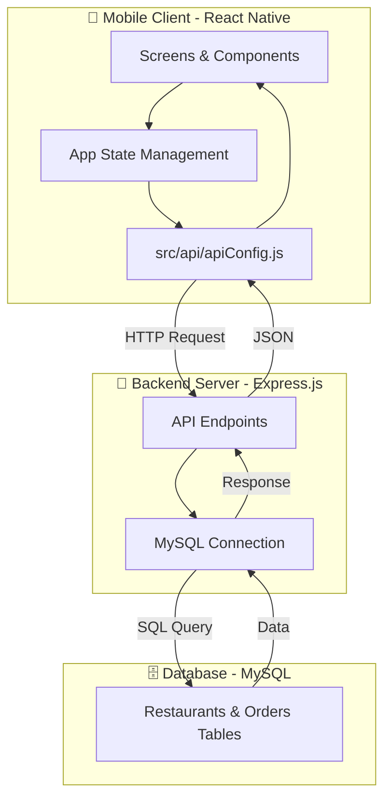

# Task 5: DesiFood Delivery App 🍔

A premium React Native (Expo) food delivery application featuring a Solar Ember theme, interactive cart management, and real-time order tracking connected to a MySQL backend.

## 📸 Visual Previews

<div align="center">
  <table style="width:100%">
    <tr>
      <td width="33%"></td>
      <td width="33%"></td>
      <td width="33%"></td>
    </tr>
    <tr>
      <td align="center"><b>Home & Featured</b></td>
      <td align="center"><b>Full Menu</b></td>
      <td align="center"><b>Favorites Section</b></td>
    </tr>
    <tr>
      <td width="33%"></td>
      <td width="33%"></td>
      <td width="33%"></td>
    </tr>
    <tr>
      <td align="center"><b>Premium Cart Modal</b></td>
      <td align="center"><b>Order History Tracking</b></td>
      <td></td>
    </tr>
  </table>
</div>

## 🚀 Features
- **Modern UI**: Vibrant "Solar Ember" design with smooth animations and glassmorphism effects.
- **Dynamic Menu**: Real-time restaurant and menu listing fetched from a MySQL database.
- **Interactive Cart**: Advanced cart logic with popping toast notifications and pulse animations.
- **Order History**: Detailed tracking of past orders with status badges (Delivered, Preparing, etc.).
- **XAMPP Integration**: Connected to a XAMPP MySQL backend via an Express.js server.

## 🛠️ Tech Stack
- **Frontend**: React Native, Expo, Expo Linear Gradient, Lucide/Ionicons.
- **Backend**: Node.js, Express.js.
- **Database**: MySQL (XAMPP).

### 🏛️ High-Level Overview




## 📂 Project Structure
```text
Task5/
├── App.js                # Main application entry and navigation
├── app.json              # Expo configuration
├── backend/
│   ├── server.js         # Express server with MySQL connectivity
│   └── setup_database.sql # SQL script to initialize tables
├── screens/
│   ├── FoodHome.js       # Main dashboard and menu
│   ├── OrderHistory.js   # List of past orders
│   └── OrderDetails.js   # Detailed view of a specific order
0└── src/api/
    └── apiConfig.js      # Global API URL configuration
```

## ⚙️ Setup Instructions

### 1. Database Setup
1. Start **Apache** and **MySQL** in your XAMPP Control Panel.
2. Go to [phpMyAdmin](http://localhost/phpmyadmin/).
3. Import the `backend/setup_database.sql` file or run its contents to create the `beautify petals_db` and necessary tables.

### 2. Backend Setup
1. Navigate to the `backend` folder:
   ```bash
   cd backend
   ```
2. Install dependencies:
   ```bash
   npm install
   ```
3. Start the server:
   ```bash
   node server.js
   ```

### 3. Frontend Setup
1. Navigate to the root folder:
   ```bash
   cd ..
   ```
2. Install dependencies:
   ```bash
   npm install
   ```
3. Update the `src/api/apiConfig.js` with your machine's IP address if testing on a physical device.
4. Start the app:
   ```bash
   npx expo start
   ```

---
Developed with ❤️ by Rukhsar.
